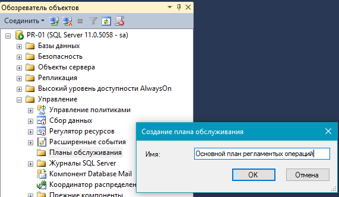
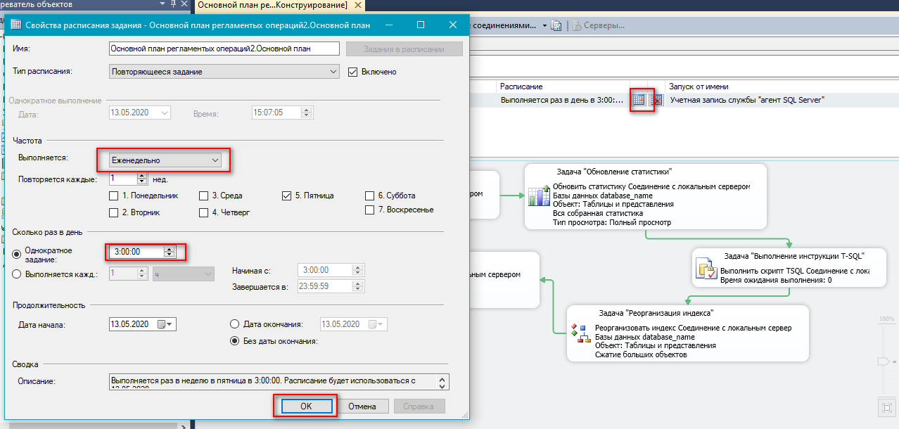
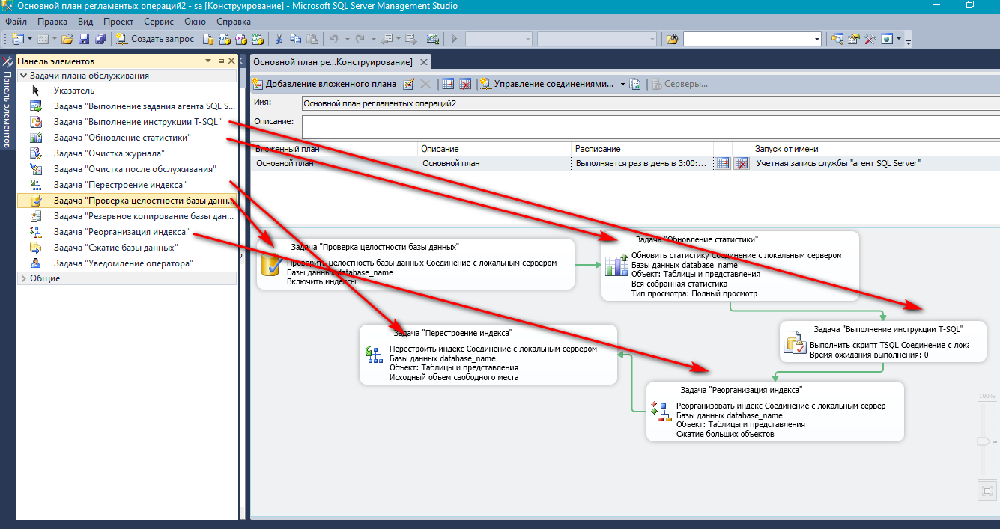
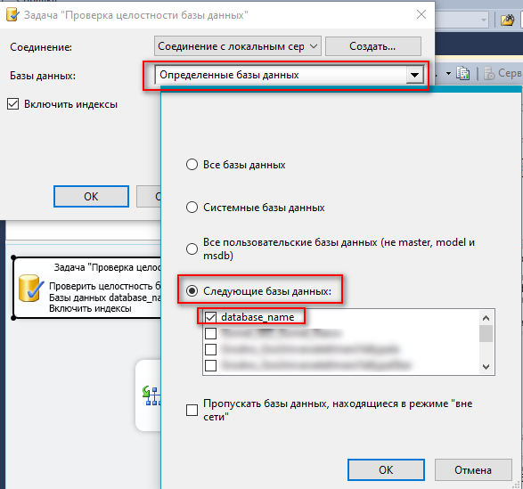
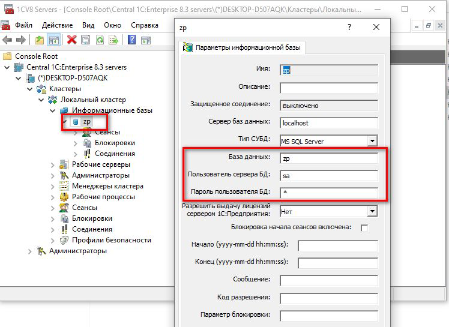

# Настройка 1c

## Базовые настройки после установки операционной системы

Установка сетевых параметров, имени компьютера, включение в домен

```powershell
New-NetIPAddress -InterfaceAlias "Ethernet0" -IPAddress 192.168.69.10 -PrefixLength 24 -DefaultGateway 192.168.69.254
Set-DnsClientServerAddress -InterfaceAlias "Ethernet0" -ServerAddresses ("192.168.69.1","192.168.69.2")
New-ItemProperty "HKLM:\SYSTEM\CurrentControlSet\Services\Tcpip6\Parameters\" -Name "DisabledComponents" -Value 0xffffffff -PropertyType "DWord"
# GLVK ключ для Windows Server 2022 Standard
slmgr.vbs -ipk VDYBN-27WPP-V4HQT-9VMD4-VMK7H
Add-Computer -NewName "1C" -DomainName "domain.lab" -OUPath "OU=Domain Servers,DC=domain,DC=lab" -Credential "Администратор@domain.lab" -Restart -Force
```

## Установка SQL Server 2019

Для хранения пользовательских баз данных и системной базы tempdb следует выделить отдельный раздел, например **D:\\**. 

1. **Диск D:\\** форматируем с размером кластера в **64 КБ**.

2. Запускаем установку *SQL Server 2019*. В компонентах выбираем **Службы ядра СУБД** и **Соединения с клиентскими средствами**.

3. На вкладке *Учетные записи служб* устанавливаем флаг **Предоставить право на выполнение задач обслуживания тома службе ядра СУБД SQL Server**.

4. На вкладке *Параметры сортировки* ставим **Cyrillic_General_CI_AS**.

5. На вкладке *Конфигурации сервера* указываем **Смешанный режим проверки подлинности**, задаем пароль суперпользователю SQL - **sa** и добавляем **текущего пользователя**.

6. На вкладке *Каталоги данных* указываем место хранения пользовательских данных: **D:\SQL_DATA**, **D:\SQL_BACKUP**.

7. На вкладке *TempDB* устанавливаем **Количество файлов - 4**, **Начальный размер от 1 ГБ**, **Авторасширение - 512 МБ**, аналогичный размер и авторасширение устанавливаем для файла журнала. Также контролируем размещение *TempDB* на диске D:\\.

## Настройка SQL Server 2019

Устанавливаем и открываем *SQL Server Management Studio*, подлючаемся к БД под учеткой *sa*.

1. Выбираем необходимый *экземпляр SQL-сервера* и переходим к *Свойствам*.
   - На вкладке *Память* устанавливаем **Минимальный размер памяти = 4096 Мб**, **Максимальный размер памяти = 8192 Мб**
   - На вкладке *Дополнительно* устанавливаем **Максимальная степень параллелизма = 1**

2. Новая база данных создается из копии базы *model*. Все настройки, указанные в *model*, будут в новой базе данных. Переходим *Базы данных* - *Служебные базы данных* - *model* - *Cвойства* - *Файлы*.
   - На вкладке *Файлы* устанавливаем **Начальный размер файла данных = 10 240 Мб**. Устанавливаем **Начальный размер журнала транзакций = 2048 Мб**. Прирост обоих файлов устанавливаем в **512 Мб**
   - На вкладке *Параметры* устанавливаем **Модель восстановления = Простая**, **Статистика автоматического создания = True**, **Асинхронное автоматическое обновление статистики = True**

3. После внесения всех изменений в конфигурацию службу SQL сервера потребуется **перезапустить**.

4. Для настройки сетевых протоколов открываем *Диспетчер конфигурации SQL Server*, переходим в раздел *Сетевая конфигурация SQL Server* - *Сетевые протоколы*, устанавливаем:
   - Общая память (Shared Memory) - **Включено**
   - Именованные каналы (Named pipes) - **Отключен**
   - TCP/IP - **Включено**

## Рекомендации по обслуживанию базы в SQL Server 2019

Данные пункты требуется выполнить для оптимальной работы базы, минимизации возникновения проблем с производительностью сервера.

1. В *SQL Server Management Studio* переходим *Управление* - *Планы обслуживания* - создаем план обслуживания и назначаем ему имя **Основной план регламентных операций**.

   

2. Откроется окно созданного плана. Меняем имя вложенного плана на **Основной план**, настраиваем план выполнения один раз в неделю на время наименьшей нагрузки - **Суббота 3:00**.

   

3. Перетягиваем из панели элементов на его рабочее поле следующие задачи и соединяем стрелками в указанной последовательности.

   

   

4. Каждую задачу нужно определить для какой она базы. После двойного клика появится окно, в которое требуется выбрать используемую базу для 1С

   

5. Для задачи *Выполнение инструкции T-SQL* следует задать код запроса **`DBCC FREEPROCCACHE`**.

6. По окончанию настроек план нужно сохранить. Для контроля выполнения плана обслуживания можно просматривать журнал плана, где будет описано удачное, неудачное (причины неудачного) выполнение задач.

## Установка 1С

После установки установки поочередно на устанавливаем:
- Cервер 1С:Предприятия (64-bit) для Windows
- Технологическая платформа 1С:Предприятия (64-bit) для Windows

После установки заходим *Пуск* - *1С Предприятие 8* - *Администрирование серверов 1С Предприятия* и создаем базу данных `zp`:



В дальнейшем при настройке клиентского приложения указываем сервер `1c.domain.lab` и базу данных `zp`.

При необходимости аналогичным способом можно создать тестовую базу данных `test` или иные (например, для отработки новых конфигураций).

## Настройка сбора логов 1С

Желательно хранить информацию об ошибках, происходящих в 1С для дальнейшего расследования причины возникновения. Для этого нужно скопировать файл **`logcfg.xml`** в папку `C:\Program Files\1cv8\conf`. После этого в течение минуты должен появиться каталог `C:\log_1С`, куда будет собираться информация об ошибках. Данный файл содержит только настройку для сбора ошибок с ограничением по времени хранения, поэтому это не создаст дополнительную нагрузку и лог практически не займет места на диске.

## Настройка счетчиков загрузки оборудования

Необходимо запустить **`Performance_Monitor_for_1C.bat`** с правами администратора для установки сбора информации для определения нагрузки на сервер. Он состоит из счетчиков:

- \Память\Обмен страниц/с
- \Память\Доступно МБ
- \Память\%% использования выделенной памяти
- \Процессор(_Total)\%% загруженности процессора
- \Система\Длина очереди процессора
- \Логический диск(*)/%% свободного места
- \Физический диск(*)\Средняя длина очереди диска
- \Физический диск(_Total)\Среднее время записи на диск (с)
- \Физический диск(_Total)\Среднее время чтения с диска (с)
- \Сетевой интерфейс(*)\Всего байт/с.

Желательно вручную еще добавить счетчик:

- «MSSQL$MSSQLSEVER:Buffer Manager -> Buffer cache hit ratio»

Он не включен в батник, т.к. имена серверов могут быть разные.